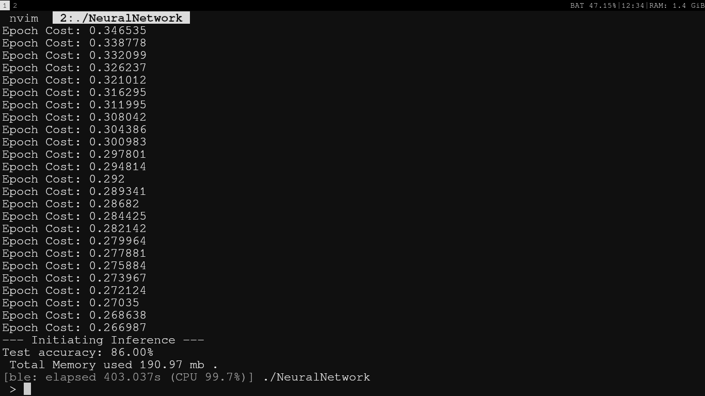
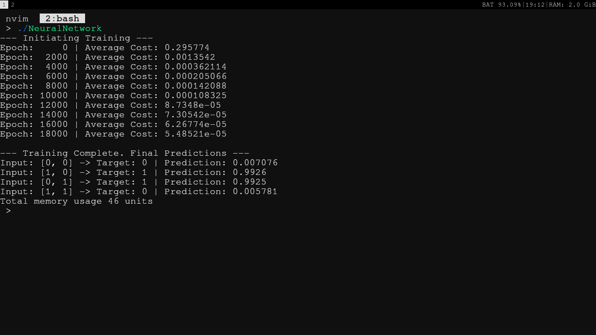

# NeuralCpp
C++ framework for neural networks . Making model and traning them.

----

# How it works

The whole framework can be divided into four major parts , the matrix , the maths , the Layer and Model and the memory management pool.


**MEMORY MANAGEMENT**
The whole memory management is a memory pool that is controlled by MatAllocator (A class) . There is two types of memory allocation , first the persistent ones and then the temporary ones. 
The memory pool is resuable , thanks to RAII , a struct DeferFree is responsible to clean the memory allocated in the scope that it lives
A global thread local pointer called __Global_Mat_Allocator is used for allocation .

**LAYER AND MODEL**
Layers is a struct that contains Matrices
Model is a struct that contains arrays of layers and provided information to the layer about the shape of the layer;

**MATHS**
Functions like MatMult that have O(N^3) complexity are NOT implemented and cblas is used for them
Functions like dot product , sum , addition , sigmoid , sigmoid prime etc are implemented 

**MATRIX**
Struct with basic information and pointer to an offset in data pool

**DATASET LOADING**
This implementation contains the data reader and praser implementation only for MNIST dataset .


----

# MNIST Traning Example
While building the binary , if you provide option -DMNIST_TEST=ON then the binary will execute a MNIST train and inference test. NOTE : You have to manualy change the test and train data set file path.



# XOR Traning Example
While building the binary , if you provide option -DXOR_TEST=ON then the binary will execute a XOR train and inference test.



    ----

# Example 
```cpp
    int main(){
        IDX3 images = readImage("/home/chirag/datasets/train-images.idx3-ubyte");
        IDX1 labels = readImageLabels("/home/chirag/datasets/train-labels.idx1-ubyte");
        constexpr auto rows = 28; 
        constexpr auto cols = 28;
        constexpr auto img_size = rows * cols; // 784

        NeuralNetwork<img_size, 2> model({128, 10});
        model.Init();

        Mat inputData;
        inputData.Populate(1, images.data.size(), false);
        inputData.Cpy(images.data.data(), images.data.size());

        const auto scale = 1.0f / 255.0f;
        MatScale(inputData, scale);

        Mat outputData;
        outputData.Populate(1, labels.labels.size() * 10, false);
        for(size_t i = 0; i < labels.labels.size(); i++) {
            for(int j = 0; j < 10; j++) {
                outputData.data[(i * 10) + j] = (j == labels.labels[i]) ? 1.0f : 0.0f;
            }
        }

        const auto epochs = 50; 
        const auto learning_rate = 1e-3;
        const auto train_count = 10000; // 10K

        std::cout << "--- Initiating Training ---\n";

        for(size_t i = 0; i < epochs; i++) {
            float epoch_cost = 0;

            for(auto j = 0; j < train_count; j++) {

                Mat input;
                input.ViewNoAlloc( 1, img_size , inputData.data + (j * img_size));

                Mat output;
                output.ViewNoAlloc(1, 10 , outputData.data + (j * 10));

                epoch_cost += Cost(model, input, output);

                BackProp(model, input, output, learning_rate);
            }
            std::cout << "Epoch Cost: " << std::setw(3) <<(epoch_cost / train_count) << "\n";
        }

        std::cout << " Total Memory used " << __Global_Mat_Allocator->GetStrider() * sizeof(float)/1e6 << " mb .\n";
        delete  __Global_Mat_Allocator;
        return 0;
    }

```

----

# Testing

```bash
git clone https://github.com/chirag-diwan/neuralCpp.git
cd neuralCpp
mkdir build && cd build
cmake -DXOR_TEST=ON .. # Dosent needs dataset to work with , if you have data set then use -DMNIST_TEST=ON
make 
./NeuralNetwork
```
