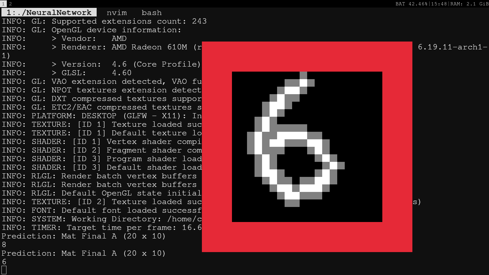

# NeuralCpp
C++ framework for neural networks . Making model and traning them.

----

# How it works

This framework is a from-scratch, CPU-bound deep learning engine. It implements a fully connected (dense) Multi-Layer Perceptron (MLP) architecture mapped directly to contiguous memory blocks. 

The system bypasses standard C++ dynamic memory allocation (`std::vector`, `new`/`delete` per matrix) during the hot path. Instead, it relies on a custom thread-local Arena Allocator and OpenBLAS for SIMD-accelerated matrix multiplication. It supports true mini-batch gradient descent and allows for runtime injection of custom mathematical activation profiles.

The whole framework can be divided into four major parts , the matrix , the maths , the Layer and Model and the memory management pool.

See ***BRIEF TUTORIAL*** for a quick overview over the APIs

**MEMORY MANAGEMENT**
The whole memory management is a memory pool that is controlled by MatAllocator (A class) . There is two types of memory allocation , first the persistent ones and then the temporary ones. 
The memory pool is resuable , thanks to RAII , a struct DeferFree is responsible to clean the memory allocated in the scope that it lives
A global thread local pointer called __Global_Mat_Allocator is used for allocation .

**LAYER AND MODEL**
Layers is a struct that contains Matrices
Model is a struct that contains arrays of layers and provided information to the layer about the shape of the layer;

**MATHS**
Functions like MatMult that have O(N^3) complexity are NOT implemented and cblas is used for them
Functions like dot product , sum , addition , sigmoid , sigmoid prime etc are implemented 

**MATRIX**
Struct with basic information and pointer to an offset in data pool

**DATASET LOADING**
This implementation contains the data reader and praser implementation only for MNIST dataset .


----

# MNIST Traning Example
While building the binary , if you provide option -DMNIST_TEST=ON then the binary will execute a MNIST train and inference test. NOTE : You have to manualy change the test and train data set file path.


# XOR Traning Example
While building the binary , if you provide option -DXOR_TEST=ON then the binary will execute a XOR train and inference test.


# Interactive Inference
While building the binary , if you provided option -DINTERACTIVE_INFERENCE=ON then binary will execute a interactive inference on a preesisting model(The one you want to inference) that in stored in the same path


    ----

# Example 
```cpp

#include "../include/Model.h"
#include "../include/Dataset.h"
#include "../include/MatMaths.h"
#include "../include/Weights.h"
#include <cassert>


thread_local MatAllocator* __Global_Mat_Allocator = new MatAllocator(128*1024*1024);

void Infer(NeuralNetwork& model, Mat& inputData, Mat& outputData, size_t test_count) {
  constexpr auto img_size = 28 * 28;

  const size_t BATCH_SIZE = model.batchsize;

  std::cout << "--- Initiating Inference ---\n";
  size_t correct_predictions = 0;
  size_t processed_count = 0;

  for (size_t batch_index = 0; batch_index < test_count; batch_index += BATCH_SIZE) {
    DeferFree df;
    size_t current_batch_size = std::min(BATCH_SIZE, test_count - batch_index);
    Mat input;
    input.ViewNoAlloc(BATCH_SIZE, img_size, inputData.data + (batch_index * img_size));

    Mat output;
    output.ViewNoAlloc(BATCH_SIZE, 10, outputData.data + (batch_index * 10));

    Forward(model, input);

    auto& final_layer_A = model.layers[model.layers.size() - 1].A;

    for (size_t b = 0; b < current_batch_size; b++) {
      float max_pred_val = -1e9f;
      size_t pred_idx = 0;

      float max_target_val = -1e9f;
      size_t target_idx = 0;

      for (size_t c = 0; c < 10; c++) {
        float p_val = final_layer_A.data[b * 10 + c];
        if (p_val > max_pred_val) {
          max_pred_val = p_val;
          pred_idx = c;
        }

        float t_val = output.data[b * 10 + c];
        if (t_val > max_target_val) {
          max_target_val = t_val;
          target_idx = c;
        }
      }

      if (pred_idx == target_idx) {
        correct_predictions++;
      }
    }
    processed_count += current_batch_size;
  }

  float accuracy = (static_cast<float>(correct_predictions) / processed_count) * 100.0f;
  std::cout << "Test accuracy: " << std::fixed << std::setprecision(2) << accuracy 
    << "% (" << correct_predictions << "/" << processed_count << ")\n";
}


inline void Activation(Mat& src , Mat& dst){
  assert(src.rows == dst.rows && src.cols == dst.cols);
  for(size_t i = 0 ; i < src.rows*src.cols ; i++){
    dst[i] = Sigmoid(src[i]);
  }
}

inline void ActivationPrime(Mat& src , Mat& dst){
  assert(src.rows == dst.rows && src.cols == dst.cols);
  for(size_t i = 0 ; i < src.rows*src.cols ; i++){
    dst[i] = SigmoidPrime(src[i]);
  }
}


int main(){

  IDX3 testImages = readImage("/home/chirag/datasets/train-images.idx3-ubyte");
  IDX1 testLabels = readImageLabels("/home/chirag/datasets/train-labels.idx1-ubyte");

  const auto img_rows = testImages.rows;
  const auto img_cols = testImages.cols;
  const auto img_size = img_rows*img_cols;

  const auto BATCH_SIZE = 20;

  ActivationProfile Profile = {
    .Activation = Activation,
    .ActivationPrime = ActivationPrime,
  };

  NeuralNetwork model({128 , 10});
  model.Init(img_size,BATCH_SIZE , Profile);

  {
    DeferFree df;
  
    Mat testInputData;
    testInputData.Populate(1, testImages.data.size(), false);
    testInputData.Cpy(testImages.data.data(), testImages.data.size());
  
    const auto scale = 1.0f/255.0f;
    MatScale(testInputData, scale);
  
    Mat testOutputData;
    testOutputData.Populate(1, testLabels.labels.size() * 10, false);
    for(size_t i = 0; i < testLabels.labels.size(); i++) {
      for(int j = 0; j < 10; j++) {
        testOutputData.data[(i * 10) + j] = (j == testLabels.labels[i]) ? 1.0f : 0.0f;
      }
    }
 
    constexpr uint32_t epoch = 400;
    constexpr uint32_t train_count = 10000;
    constexpr float learning_rate = 1e-2;
  
    for(int e = 0 ; e < epoch ; e++){
      float epoch_cost = 0.0f;
      for(int batch_index = 0 ; batch_index < train_count ; batch_index += BATCH_SIZE){
        DeferFree df;
        Mat input;
        input.Populate(BATCH_SIZE,img_size ,false);
        auto index = batch_index*img_size;
        input.Cpy(&testInputData.data[index] , BATCH_SIZE*img_size);
  
        Mat output;
        output.Populate(BATCH_SIZE, 10, false);
        index = batch_index*10;
        output.Cpy(&testOutputData.data[index] , BATCH_SIZE*10);
        epoch_cost += Cost(model, input, output);
        BackProp(model,input, output,  learning_rate , BATCH_SIZE);
      }
      std::cout << "Epoch Cost :: " << epoch_cost/train_count << "\n";
    }
    std::cout << " Memory Usage :: " << __Global_Mat_Allocator->GetStrider()*sizeof(float)/1e6 << "mb\n";
  }
  
  SaveModel(model,28*28,"MNIST-TEST.bin");

  {
    DeferFree df;

    Mat testInputData;
    testInputData.Populate(1, testImages.data.size(), false);
    testInputData.Cpy(testImages.data.data(), testImages.data.size());

    const auto scale = 1.0f/255.0f;
    MatScale(testInputData, scale);

    Mat testOutputData;
    testOutputData.Populate(1, testLabels.labels.size() * 10, false);
    for(size_t i = 0; i < testLabels.labels.size(); i++) {
      for(int j = 0; j < 10; j++) {
        testOutputData.data[(i * 10) + j] = (j == testLabels.labels[i]) ? 1.0f : 0.0f;
      }
    }

    Infer(model , testInputData , testOutputData ,100);
    std::cout << " Total Memory used to test " << __Global_Mat_Allocator->GetStrider() * sizeof(float)/1e6 << " mb .\n";
  }

  delete __Global_Mat_Allocator;
}

```

----

# Testing

```bash
git clone https://github.com/chirag-diwan/neuralCpp.git
cd neuralCpp
mkdir build && cd build
cmake -DXOR_TEST=ON .. # Dosent needs dataset to work with , if you have data set then use -DMNIST_TEST=ON
make 
./NeuralNetwork
```

# BRIEF TUTORIAL

***

## Dependencies
* **OpenBLAS:** Required for core matrix multiplication and scalar operations (`cblas_sgemm`, `cblas_sscal`, `cblas_saxpy`).
* **C++17 or higher:** Required for `std::make_unique`, `constexpr`, and modern standard library features.

## The Memory Model: Arena Allocation and RAII
Standard dynamic memory allocation is the primary bottleneck in CPU-bound machine learning. This framework eliminates allocation overhead during training and inference by using a pre-allocated linear memory arena (`MatAllocator`).

### The `MatAllocator`
A thread-local global pointer `__Global_Mat_Allocator` manages a single, massive contiguous float array (e.g., 128MB). 
When a `Mat` (Matrix) is populated, it does not request memory from the OS; it advances a `strider` index within the arena and takes ownership of that specific segment.

### The `DeferFree` Contract
Because the allocator is linear, memory is never individually freed. It must be scoped and rewound. This is handled via the `DeferFree` RAII structure.

Whenever entering a loop (e.g., a training batch or an inference step) that spawns temporary matrices, you must instantiate a `DeferFree` object.
1.  **Construction:** Captures the current integer position of the allocator's `strider`.
2.  **Destruction:** When the scope ends, the `strider` is violently snapped back to the captured position.

**Critical Warning:** Failure to scope a batch loop with `DeferFree` will cause temporary matrices (costs, gradients, activations) to permanently stack in the arena. The program will exhaust the memory pool and trigger a core dump within seconds.

```cpp
// Correct Memory Scoping Example
for(int batch_index = 0; batch_index < train_count; batch_index += BATCH_SIZE) {
    DeferFree df; // Strider captured
    
    Mat input;
    input.Populate(BATCH_SIZE, img_size, false); // Strider advances
    
    Forward(model, input); // Hidden layer matrices advance strider further
    
} // df goes out of scope. Strider rewinds. Memory is sanitized for the next batch.
```

### Zero-Allocation Slicing (`ViewNoAlloc`)
To feed data from a master dataset into a batch without copying memory, the `Mat` structure supports `ViewNoAlloc`. This function binds the matrix dimensions to a specific memory address offset from the master dataset array, bypassing the allocator entirely.

```cpp
Mat input;
// Binds the matrix to a specific batch chunk of the raw dataset
input.ViewNoAlloc(BATCH_SIZE, img_size, testInputData.data + (batch_index * img_size));
```

## Mathematical Injection: The Activation Profile
The framework decouples the neural network's forward and backward propagation logic from the specific activation mathematics. Developers define the math via the `ActivationProfile` struct and inject it during model initialization.

An `ActivationProfile` requires two strictly correlated function pointers:
1.  **Forward Pass (`Activation`):** The non-linear transformation applied to the pre-activation matrix.
2.  **Backward Pass (`ActivationPrime`):** The analytical derivative of the forward pass, required for the chain rule during backpropagation.

**Mathematical Warning:** The framework blindly trusts the provided contract. If the derivative function does not mathematically match the forward function, the gradients will corrupt, and the network will suffer from gradient explosion or vanishing, silently failing to converge.

```cpp
// 1. Define the mathematical operations
inline void MyCustomActivation(Mat& src, Mat& dst) {
    // Custom non-linear logic
}

inline void MyCustomDerivative(Mat& src, Mat& dst) {
    // Exact analytical derivative of the logic above
}

// 2. Bind the contract
ActivationProfile Profile = {
    .Activation = MyCustomActivation,
    .ActivationPrime = MyCustomDerivative,
};

// 3. Inject into the architecture
NeuralNetwork model({128, 10});
model.Init(img_size, BATCH_SIZE, Profile);
```
